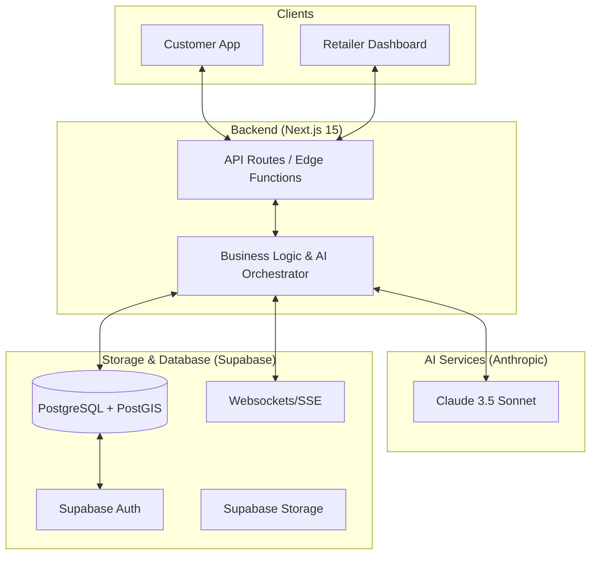

# DealDrop ⚡: Hyperlocal Flash Sale Platform

Connecting local retailers with nearby customers through real-time, location-based flash deals. 

> **DealDrop** bridges the gap between expiring inventory and price-conscious customers in real-time. Built for the **Savara Hackathon 2026**.

---

## 📌 Problem Statement

Local retailers often face significant challenges in clearing overstocked or near-expiry inventory. This is primarily due to a limited digital presence and low visibility among potential customers in their immediate vicinity. At the same time, nearby customers remain unaware of these time-sensitive deals, missing out on potential savings and high-quality products.

**The Impact:**
- **Retailers:** Lost revenue, high wastage costs, and inventory bloat.
- **Customers:** Reduced access to affordable essentials and premium local goods.
- **Environment:** Increased landfill waste from unsold perishable goods.

## 💡 The Solution: DealDrop

DealDrop is a hyperlocal discovery platform that turns "waste" into "win-win." By leveraging geospatial technology (PostGIS) and AI, we enable retailers to liquidate stock in minutes while giving customers instant access to massive discounts within walking distance.

---

## 🏗️ Technical Architecture



---

## 🚀 Core Features (Deep Dive)

### 📍 1. Hyperlocal Feed (PostGIS Powered)
Unlike traditional search, DealDrop uses **PostGIS** `ST_DWithin` calculations to fetch deals strictly within a user's chosen radius (e.g., 500m to 5km).
- **Functionality:** Real-time distance-based sorting and map visualization using **Leaflet.js**.
- **Tech:** `GEOGRAPHY(POINT)` data types for precise earth-curvature calculations.

### 🗣️ 2. AI Voice-to-Deal (NLP Parsing)
Retailers are busy. Instead of filling out complex forms, they can simply speak: *"I have 20 loaves of sourdough expiring tonight, regular price ₹150, sell for ₹60."*
- **Mechanism:** **Claude 3.5 Sonnet** parses the transcript into structured JSON (Product Name, Quantity, Category, Expiry).
- **Benefit:** Reduces deal creation time from minutes to seconds.

### 📉 3. AI Dynamic Pricing Engine
Our pricing AI suggests the "sweet spot" discount to ensure 100% stock clearance.
- **Inputs:** Hours until expiry, stock ratio (remaining/total), and category perishability (e.g., Dairy vs. General).
- **Output:** Urgency tiers (Low, Medium, High, Critical) and suggested price points.

### 👫 4. Flash Mob Squads (Social Commerce)
Gamified group-buying that fosters community. 
- **The Catch:** A deal might be 30% off individually, but 50% off if a "Squad" of 10 people claims it within 2 hours.
- **Real-time:** Uses **Supabase Realtime** to sync squad member counts across all users instantly.

### 🏆 5. Deal Passport & Pulse
- **Gamification:** Customers earn "Stamps" for every local business they support, increasing their rank (Bronze to Diamond).
- **Pulse Feed:** A live, scrolling feed of nearby claims to create "Social Proof" and FOMO.

---

## 🛠️ Technology Stack

| Layer | Tools |
| :--- | :--- |
| **Framework** | Next.js 15 (App Router), TypeScript, React 19 |
| **Styling** | Tailwind CSS 4, Shadcn UI, Lucide Icons |
| **Database** | Supabase (PostgreSQL + PostGIS) |
| **AI** | Anthropic Claude SDK (Sonnet 3.5) |
| **State** | Zustand (Global State), TanStack Query (Server State) |
| **Real-time** | Supabase Realtime (Websockets), Web-Push Notifications |
| **Maps** | Leaflet.js, OpenStreetMap |
| **Analytics** | Recharts |

---

## 🗄️ Database Schema

### Core Tables
- **`user_profiles`**: Stores customer preferences, location, and Passport rank.
- **`retailers`**: Business details, PostGIS location, verification status, and fulfillment ratings.
- **`deals`**: The heart of the platform. Tracks product info, dynamic pricing, and PostGIS location.
- **`claims`**: Junction table for user-deal reservations with QR-ready status tracking.
- **`squads`**: Manages group-buying pools, target counts, and expiry timers.

### Key RPC Functions
- `get_nearby_deals(lat, lng, radius_km)`: Optimized PostGIS query for spatial discovery.
- `increment_passport_stamps(uid)`: Atomic updates for loyalty gamification.

---

## ⚙️ Setup & Installation

### 1. Prerequisites
- Node.js v18.17+
- Supabase account with a new project

### 2. Configure Environment
Create a `.env.local` file:
```env
NEXT_PUBLIC_SUPABASE_URL=your_project_url
NEXT_PUBLIC_SUPABASE_ANON_KEY=your_anon_key
SUPABASE_SERVICE_ROLE_KEY=your_service_role_key
ANTHROPIC_API_KEY=your_claude_api_key
```

### 3. Database Initialization
Run the migrations located in `./supabase/migrations` via the Supabase SQL Editor.
1. Enable `postgis` extension.
2. Create tables and set up RLS policies.
3. Pulse-check with `seed-deals.js` to populate mock data.

### 4. Local Development
```bash
npm install
npm run dev
```

---

## 🛡️ Security & Performance
- **Row Level Security (RLS)**: Ensures retailers can only manage their own deals and customers only see active data.
- **Edge Runtime**: API routes optimized for low-latency location-based responses.
- **PWA Ready**: Built with Service Workers in mind for mobile-first "on-the-go" usage.

---

## 🏗️ Future Roadmap
- [ ] **Smart Push:** AI-driven notifications based on user "Walking Routines."
- [ ] **Retailer Inventory Sync:** Direct integration with POS systems (Shopify/Square).
- [ ] **Community Quests:** Neighborhood-wide goals to reach "Zero Waste" targets.

